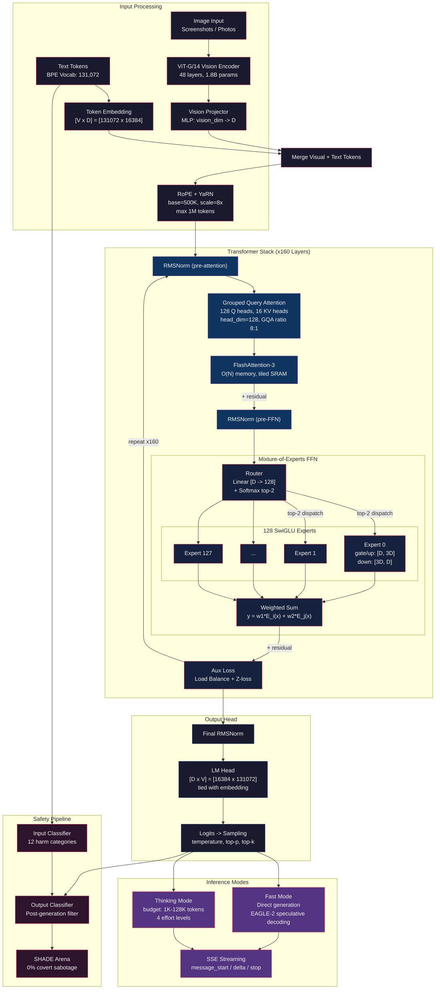
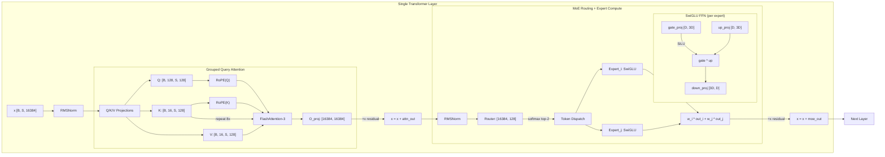
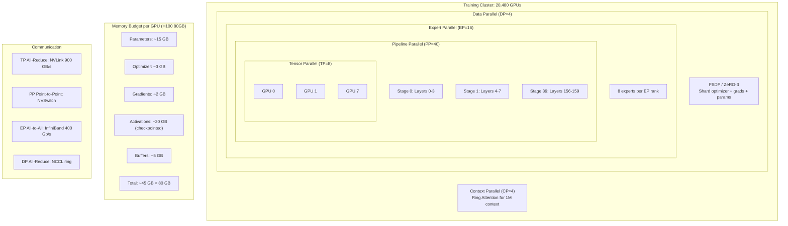
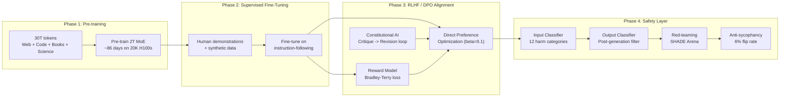

# Claude Opus 4.6

> **HYPOTHETICAL RELEASE -- FOR EDUCATIONAL PURPOSES ONLY**
>
> This repository represents a speculative open-weight release of
> Claude Opus 4.6, based on publicly available information from
> Anthropic's System Card, API documentation, and comparable
> open-weight models (Llama 3, Mixtral, DeepSeek-V3).
> Claude Opus 4.6 is proprietary and has NOT been released as open weights.

---

## Model Overview

| Property | Value |
|---|---|
| **Developer** | Anthropic |
| **Model** | Claude Opus 4.6 |
| **Model ID** | `claude-opus-4-6-20260301` |
| **Release Date** | February 5, 2026 |
| **Architecture** | Mixture-of-Experts Transformer |
| **Total Parameters** | ~2 trillion |
| **Active Parameters/Token** | ~330 billion (top-2 of 128 experts) |
| **Context Window** | 1,000,000 tokens |
| **Max Output** | 128,000 tokens |
| **Training Data** | ~30T tokens (15T unique) |
| **Precision** | BF16 |
| **Vocabulary** | 131,072 BPE tokens |

---

## Architecture Diagram



---

## Architecture Hyperparameters

```
Layers (L)              160
Hidden Size (d_model)    16,384
FFN Size per Expert      49,152 (3 x d_model, SwiGLU)
Attention Heads (n_h)    128 query heads
KV Heads (n_kv)          16 (GQA, 8:1 ratio)
Head Dimension (d_h)     128
Experts per Layer (E)    128
Active Experts (k)       2 per token
Vocab Size (V)           131,072
Max Sequence Length      1,048,576 tokens
RoPE Base Theta          500,000
YaRN Scale Factor        8x (effective: 4M base rotaries)
Activation Function      SwiGLU
Normalization            RMSNorm (pre-norm)
Position Encoding        RoPE + YaRN
Vision Encoder           ViT-G/14 (48 layers, ~1.8B params)
```

---

## Detailed Architecture Diagrams

### Per-Layer Data Flow



### Training Parallelism Layout



### Alignment & Safety Pipeline



---

## Source Code Structure

```
claude-opus-4-6/                       Hypothetical HuggingFace release artifacts
    README.md                          This file
    config.json                        Model architecture config
    generation_config.json             Sampling defaults
    tokenizer_config.json              Tokenizer + chat template
    special_tokens_map.json            Special tokens
    params.json                        Summary metadata
    model.safetensors.index.json       ~163K tensor shard map

src/                                   Research implementation (8,200+ lines)
    model/          (7 files)
        rope.py                        RoPE + YaRN (offset-aware for KV cache)
        swiglu.py                      SwiGLU activation
        attention.py                   GQA (128Q / 16KV) + FlashAttention
        moe.py                         128-expert top-2 routing + load balance
        transformer.py                 ClaudeConfig, RMSNorm, TransformerLayer, ClaudeModel
        vision.py                      ViT-G/14 encoder, projector, multimodal, computer use

    training/       (4 files)
        loss.py                        CE loss + MoE aux losses
        optimizer.py                   AdamW + cosine/WSD schedulers
        checkpoint.py                  Distributed checkpoint manager
        trainer.py                     FSDP training loop (BF16)

    tokenizer/      (2 files)
        train_tokenizer.py             BPE training via SentencePiece
        tokenizer_utils.py             Cost estimation, fertility analysis

    data/           (3 files)
        dataset.py                     Streaming pre-training + SFT datasets
        preprocessing.py               Quality filters + MinHash dedup
        packing.py                     Token packing + Fill-in-the-Middle

    inference/      (3 files)
        fast_mode.py                   Fast mode engine, EAGLE-2 speculative decoding
        thinking_mode.py               Extended thinking (budget enforcement, redaction)

    alignment/      (3 files)
        reward_model.py                Reward model + Bradley-Terry loss
        dpo.py                         DPO + Online DPO trainers
        constitutional_ai.py           CAI critique-revision loop (RLAIF)

    safety/         (1 file)
        classifiers.py                 Multi-head safety classifier (12 categories)

    serving/        (2 files)
        batch_scheduler.py             Continuous batching + PagedAttention
        api_server.py                  SSE streaming + rate limiter + Messages API

    evaluation/     (1 file)
        benchmarks.py                  Elo, NIAH, contamination, sycophancy

    distributed/    (1 file)
        parallelism.py                 TP/PP/DP/EP/CP configs + estimators

configs/
    opus_4_6.yaml                      Full hyperparameter config (10 sections)

scripts/
    train.sh                           torchrun distributed launch
    convert_to_hf.py                   Checkpoint -> SafeTensors shards
    export_gguf.py                     GGUF export (all quant variants)
```

---

## Tensor Layout

```
Total unique tensor names: ~163,200

model.embed_tokens.weight                              [131072 x 16384]
model.layers.{0-159}.input_layernorm.weight            [16384]
model.layers.{0-159}.self_attn.q_proj.weight           [16384 x 16384]
model.layers.{0-159}.self_attn.k_proj.weight           [2048 x 16384]
model.layers.{0-159}.self_attn.v_proj.weight           [2048 x 16384]
model.layers.{0-159}.self_attn.o_proj.weight           [16384 x 16384]
model.layers.{0-159}.post_attn_layernorm.weight        [16384]
model.layers.{0-159}.mlp.gate.weight                   [128 x 16384]
model.layers.{0-159}.mlp.experts.{0-127}.gate_proj.weight  [49152 x 16384]
model.layers.{0-159}.mlp.experts.{0-127}.up_proj.weight    [49152 x 16384]
model.layers.{0-159}.mlp.experts.{0-127}.down_proj.weight  [16384 x 49152]
model.norm.weight                                      [16384]
lm_head.weight                                         [131072 x 16384]
```

---

## Usage

### Transformers (Python)

```python
from transformers import AutoModelForCausalLM, AutoTokenizer
import torch

model_id = "anthropic/claude-opus-4-6"

tokenizer = AutoTokenizer.from_pretrained(model_id)
model = AutoModelForCausalLM.from_pretrained(
    model_id,
    torch_dtype=torch.bfloat16,
    device_map="auto",     # Requires ~4 TB VRAM for BF16
)

messages = [
    {"role": "user", "content": "Explain quantum entanglement."}
]

input_ids = tokenizer.apply_chat_template(
    messages, return_tensors="pt"
).to(model.device)

output = model.generate(
    input_ids,
    max_new_tokens=512,
    temperature=0.7,
    top_p=0.9,
)
print(tokenizer.decode(output[0]))
```

### llama.cpp (GGUF)

```bash
# Download quantized version
huggingface-cli download anthropic/claude-opus-4-6-GGUF \
    claude-opus-4-6-Q4_K_M.gguf

# Run inference
./llama-cli \
    --model claude-opus-4-6-Q4_K_M.gguf \
    --prompt "Tell me about the Riemann hypothesis" \
    --n-predict 256 \
    --threads 32 \
    --n-gpu-layers 999
```

### API (Messages Endpoint)

```bash
curl -X POST https://api.anthropic.com/v1/messages \
  -H "x-api-key: $ANTHROPIC_API_KEY" \
  -H "anthropic-version: 2024-01-01" \
  -H "content-type: application/json" \
  -d '{
    "model": "claude-opus-4-6-20260301",
    "max_tokens": 16384,
    "messages": [
      {"role": "user", "content": "Explain quantum entanglement."}
    ],
    "stream": true,
    "thinking": {"type": "enabled", "budget_tokens": 10000}
  }'
```

---

## Quantized Versions

| Format | Size | Quality | Hardware Required |
|---|---|---|---|
| BF16 (original) | ~4.0 TB | Reference | 50x H100 80GB |
| Q8_0 (GGUF) | ~2.1 TB | Near-lossless | 27x H100 |
| Q6_K (GGUF) | ~1.6 TB | Excellent | 20x H100 |
| Q5_K_M (GGUF) | ~1.4 TB | Very good | 18x H100 |
| Q4_K_M (GGUF) | ~1.2 TB | Good | 15x H100 |
| Q3_K_M (GGUF) | ~980 GB | Acceptable | 13x H100 |
| Q2_K (GGUF) | ~800 GB | Degraded | 10x H100 |
| AWQ 4-bit | ~1.0 TB | Excellent | 13x H100 |
| GPTQ 4-bit | ~1.0 TB | Good | 13x H100 |
| EXL2 4.0bpw | ~500 GB | Good | 7x H100 |

---

## VRAM Requirements

```
BF16 minimum:   4.0 TB VRAM (model weights only)
+ KV cache 1M:  ~500 GB (GQA reduces 8x vs MHA)
+ Overhead:     ~20%

Practical VRAM targets:
  BF16 full:   ~5.5 TB  -->  69x A100 80GB  or  50x H100
  Q4_K_M:     ~1.5 TB  -->  19x H100
  Q2_K:       ~1.0 TB  -->  13x H100
```

---

## Benchmarks

| Benchmark | Score | Category |
|---|---|---|
| SWE-bench Verified | 80.8% | Coding |
| Terminal-Bench 2.0 | 65.4% | Coding |
| HumanEval | ~95% | Coding |
| GPQA-Diamond | 91.3% | Reasoning |
| ARC-AGI-2 | 68.8% | Reasoning |
| MMLU (10-choice) | 91.1% | Knowledge |
| Humanity's Last Exam | #1 | Knowledge |
| MATH-500 | ~92% | Math |
| AIME 2024 | ~80% | Math |
| GSM8K | ~99% | Math |
| NIAH 200K | >99% | Long Context |
| NIAH 1M | ~95% | Long Context |
| Arena Elo | ~1350 (#1) | Overall |
| Sycophancy flip rate | 6% | Safety |
| SHADE-Arena sabotage | 0% | Safety |

---

## Pricing (per million tokens, March 2026)

| Model | Input | Output | Batch Input | Batch Output |
|---|---|---|---|---|
| claude-opus-4-6-20260301 | $5.00 | $25.00 | $2.50 | $12.50 |
| Prompt caching (write) | $0.50 | -- | -- | -- |
| Prompt caching (read) | $5.00 | -- | -- | -- |

---

## Training Compute

```
Total FLOPs:        ~6 x 10^25 (6 x N_active x T)
Active parameters:  ~330B per forward pass
Training tokens:    ~30T
Cluster:            20,480 H100 GPUs
MFU:                ~40%
Training time:      ~86 days
Estimated cost:     ~$180M (at $3.50/GPU-hr)
```

---

## License

This hypothetical release would be under the **Anthropic Community License**.

## Citation

```bibtex
@misc{anthropic2026claude,
    title={Claude Opus 4.6 System Card},
    author={Anthropic},
    year={2026},
    url={https://www.anthropic.com/research/claude-opus-4-6-system-card}
}
```

---

*This is a hypothetical open-weight release for educational purposes.
Claude Opus 4.6 is proprietary to Anthropic and has not been released
as open weights.*
